# Envizi Dataflow - Sending UDC excel template to S3 for data ingestion

This article explains about how to setup Envizi Dataflow automation for sending Universal Data Connector excel to Envizi via S3 bucket.

#### Authors
[Jeya Gandhi Rajan M](https://community.ibm.com/community/user/envirintel/people/jeya-gandhi-rajan-m1), [Indira Kalagara](https://community.ibm.com/community/user/envirintel/people/indira-kumari-kalagara1)


## 1. Create Data Service for S3

Need to create a Data Service for S3 bucket.

1. Open the Data Services by clicking  `Admin > Data flow Automation`

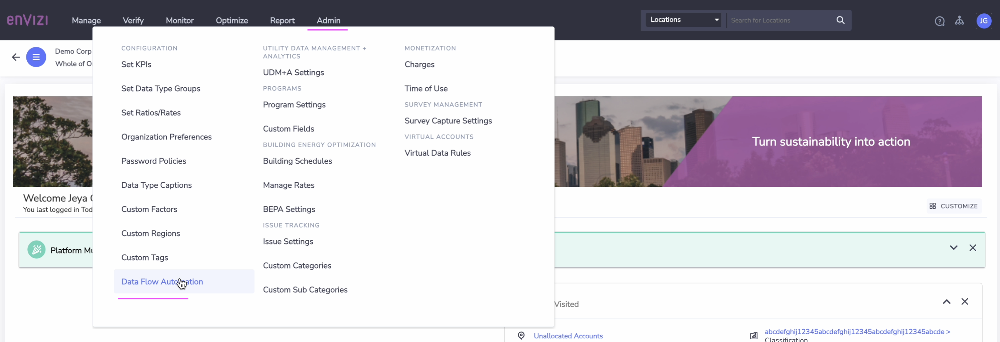

The Data services page is opened.

2. Click on `Add New Service`

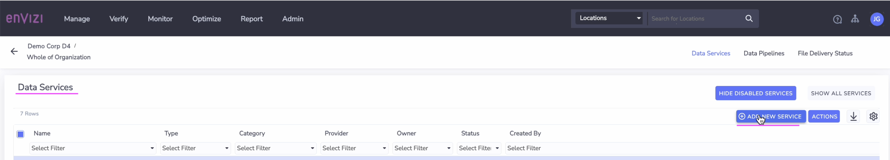

3. Enter the following.

- Type : Amazon S3
- Onwer : Envizi
- Name : Enter any value

4. Click on `Save`

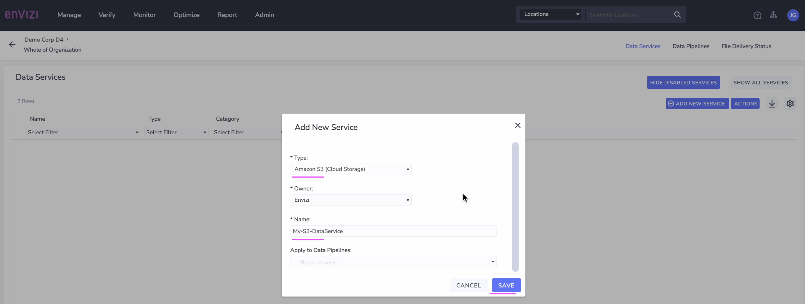

The Data service is created.

5. Open the Data Services by clicking  `Actions > Manage Connections`

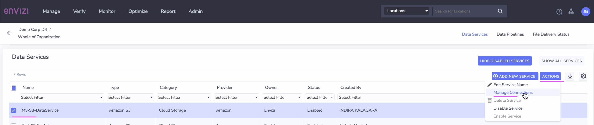

The `Manage Connections` page of the data service is opened.

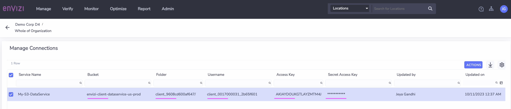

6. Note down the values of the following in a text file
- Bucket 
- Folder
- UserName
- Access Key
- Secret Access Key


## 2. Create Data Pipeline

Need to create Data pipeline to download udc files from S3 bucket and push to Envizi for data ingestion. 

1. Open the Data Pipeline by clicking  `Data pipelines` from the top links.

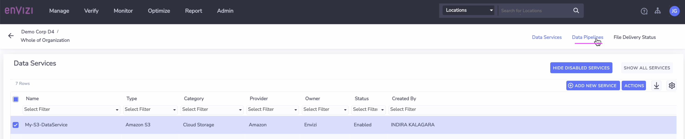

The Data pipelines page is displayed.

2. Click on `Add New Pipeline`

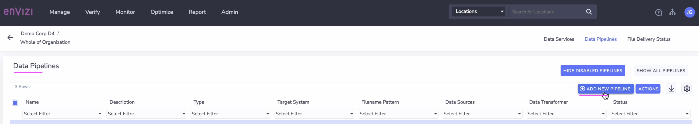

3. Enter the following.

- Name : Enter any value
- Target System : Accounts
- FileName Pattern : Regex pattern need to be given. For Accounts related data the file starts with POC. ex: ^POC.*\.xlsx
- Data Source : Give the S3 data source that we created before
- Data Transformer : None. (No need of any transformation.)

4. Click on `Save`

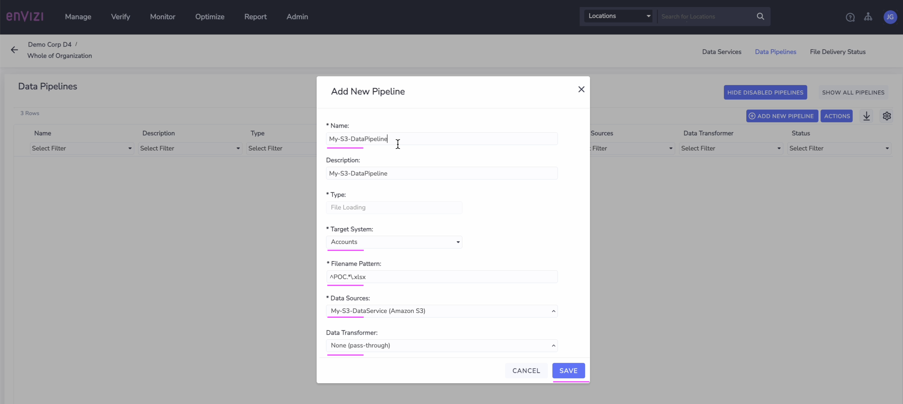

The Data pipeline is created.

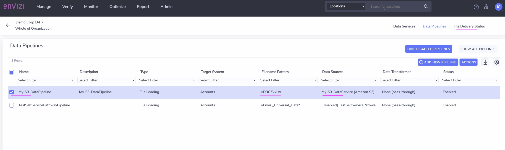


## 3. Sending UDC excel to S3

Lets use the sample python script [main.py](./python/main.py) to push the [data.xlsx](./python/data.xlsx) file into S3 now. 


1. Download the `main.py` and `data.xlsx` files into a folder.

2. Update the `Location` column in the `data.xlsx` with the some existing location in your envizi environment.

Here is the sample content of the excel file.

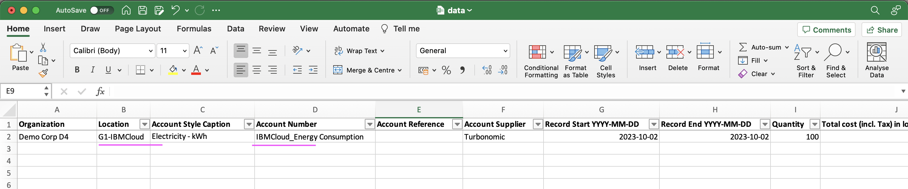


3. Open the linux/mac terminal window and goto folder where you downloaded the `main.py` file.

4. Instal the `boto3` for python if it is not available in your system.
```
python -m pip install boto3
```

5. Run the below command with your S3 Data service values.
```
export s3_BUCKET_NAME=envizi-client-dataservice-us-prod
export s3_FOLDER_NAME=client_9608cd600af647
export s3_ACCESS_KEY=AKIxxxxxxxxxxxxxxx
export s3_SECRET_KEY=axhHxxxxxxxxxxxxxx

```
6. Run the below command to push the file to S3
```
python main.py
```

you may get the output like this..
```
S3Handler  ...
 ENVIZI_S3_AWS_BUCKET_NAME : envizi-client-dataservice-us-prod
 ENVIZI_S3_AWS_FOLDER_NAME : client_9608cd600af647
output/results-10122023-110535-725742/POC Account Setup and Data Load_G1_20231012-110543.xlsx is uploaded to envizi-client-dataservice-us-prod  : client_9608cd600af647/POC Account Setup and Data Load_G1_20231012-110543.xlsx
2023-10-12 11:05:45,747 - INFO:127.0.0.1 - - [12/Oct/2023 11:05:45] "POST /api/turbo/query HTTP/1.1" 200 -
```

The envizi should have processed your file now.

7. Goto file delivery status screen by Clicking on `File Delivery Status`

You can see the status of your file and notice that it has got processed.

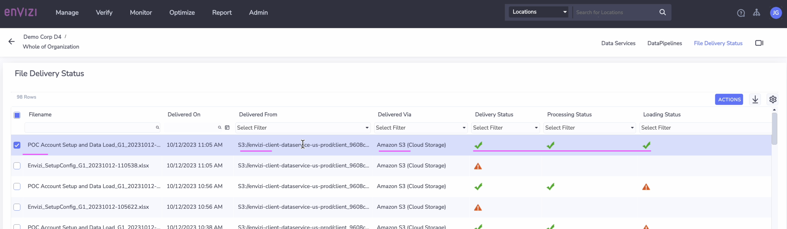


8. You can see the account got created and available in the Org Hierarchy.

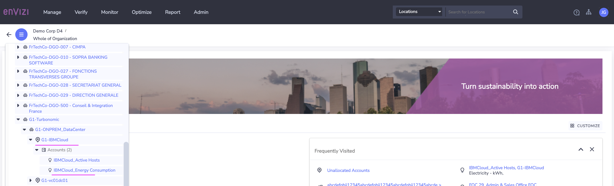


#Envizi
#ESG
#Sustainability
#sustainability-highlights-home

